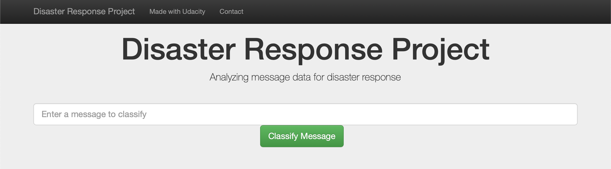

# Disaster Response Pipeline Project

Creates a natural language processing model for prediction in disaster response
web app.

See screenshot folder for example of search result and category detection

### Table of Contents

 1. Installation
 2. Instructions
 3. File Descriptions
 4. Results
 5. Issues
 6. Licensing, Authors, and Acknowledgements

### 1. Installation.

run `pip install -r requirements.txt` in the directory to install modules/
packages needed for this web app.

### 2. Instructions:

1. Run the following commands in the project's root directory to set up your
   database and model.
    - To run ETL pipeline that cleans data and stores in database
        `python data/process_data.py data/disaster_messages.csv data/disaster_categories.csv data/Responsedata.db`
    - To run ML pipeline that trains classifier and saves
        `python models/train_classifier.py data/Responsedata.db models/classifier.pkl`

2. Run the following command in the app's directory to run your web app.
  `python run.py`

3. Go to http://0.0.0.0:3001/

## 3. File Descriptions

The response_pipeline folder has 3 sub folders.
 - app : `run.py` : file that runs the web app with
         `figure.py` : suppling the graphs for plotting

 - data : this unsuprisingly contains the base training data along with the data
          cleaning file `process_data.py`
 - models : `train_classifier.py` is where the classifier gets created, trained
            and saved for later prediction

## 4. Results

Despite returning an accuracy of over 90% on the training data I can't help feel
that this model needs improving. Taxonomy would help improve this as there are
a lot of categories that are under represented and will be predicted less as a
result. A greater importance should probably given to individual words in each
message as with a median of just 10 words,

## 5. Issues
1. I want the app to work with Heroku however, despite being close, I have yet
to get it running.

2. As stated above. I would like to (and attempted to) using some taxonomy
within the model. With a large number of the categories with few examples to
train from they are seldom predicted. Within 'process_data.py' you will find an
attempt at this but it only reduced accuracy so it's been commented out for the
time being.

## 6. Licensing, Authors, and Acknowledgements

All data was provided by figureeight for the purpose of this project.

Website:[Download](https://appen.com/datasets/combined-disaster-response-data/)

Copyright 2021 Ben Stone

Permission is hereby granted, free of charge, to any person obtaining a copy of this software and associated documentation files (the "Software"), to deal in the Software without restriction, including without limitation the rights to use, copy, modify, merge, publish, distribute, sublicense, and/or sell copies of the Software, and to permit persons to whom the Software is furnished to do so, subject to the following conditions:

The above copyright notice and this permission notice shall be included in all copies or substantial portions of the Software.

THE SOFTWARE IS PROVIDED "AS IS", WITHOUT WARRANTY OF ANY KIND, EXPRESS OR IMPLIED, INCLUDING BUT NOT LIMITED TO THE WARRANTIES OF MERCHANTABILITY, FITNESS FOR A PARTICULAR PURPOSE AND NONINFRINGEMENT. IN NO EVENT SHALL THE AUTHORS OR COPYRIGHT HOLDERS BE LIABLE FOR ANY CLAIM, DAMAGES OR OTHER LIABILITY, WHETHER IN AN ACTION OF CONTRACT, TORT OR OTHERWISE, ARISING FROM, OUT OF OR IN CONNECTION WITH THE SOFTWARE OR THE USE OR OTHER DEALINGS IN THE SOFTWARE.
